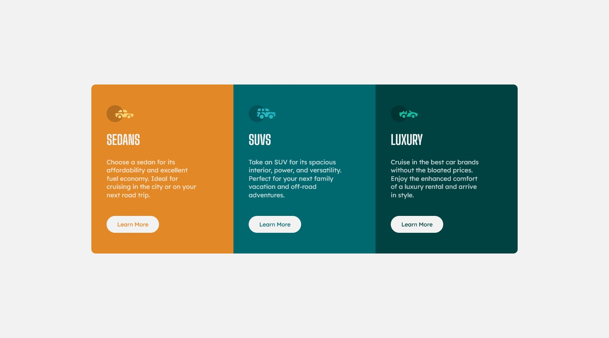

# Frontend Mentor - 3-column preview card component solution

This is a solution to the [3-column preview card component challenge on Frontend Mentor](https://www.frontendmentor.io/challenges/3column-preview-card-component-pH92eAR2-). Frontend Mentor challenges help you improve your coding skills by building realistic projects. 

## Table of contents

- [Overview](#overview)
  - [The challenge](#the-challenge)
  - [Screenshot](#screenshot)
  - [Links](#links)
- [My process](#my-process)
  - [Built with](#built-with)
  - [What I learned](#what-i-learned)
  - [Useful resources](#useful-resources)
- [Author](#author)

## Overview

### The challenge

Users should be able to:

- View the optimal layout depending on their device's screen size
- See hover states for interactive elements

### Screenshot

### Links

- Solution URL: [GitHub - GrzywN/3-column-preview-card-component-main](https://github.com/GrzywN/3-column-preview-card-component-main)
- Live Site URL: [Repl.it](https://3-column-preview-card-component-main.grzywn.repl.co)

## My process

### Built with

- Semantic HTML5 markup
- SCSS custom properties
- SCSS/SASS preprocessor
- BEM methodology
- CSS Grid
- Flexbox
- Custom CSS animations/transitions

### What I learned

That was my first project when I was using a CSS grid for building layout. It was great for that and I learned so much about CSS grid and now I am ready to use it in bigger projects. While styling I used repeat() and minmax() functions, which are great solution for responsiveness problems.

### Useful resources

Those videos helped me in the path of learning CSS grid. I watched them all and if you want to learn grid like me I recommend examining these videos.

- [CSS Grid Tutorial | CSS Grid Crash Course - YouTube](https://youtu.be/EFafSYg-PkI)
- [Learn CSS Grid the easy way - YouTube](https://youtu.be/rg7Fvvl3taU)
- [Learn CSS Grid in 20 Minutes - YouTube](https://youtu.be/9zBsdzdE4sM)

## Author

- GitHub - [GrzywN (Karol Binkowski) · GitHub](https://github.com/GrzywN)
- Frontend Mentor - [@GrzywN](https://www.frontendmentor.io/profile/GrzywN)
- Discord - fansik#2808
